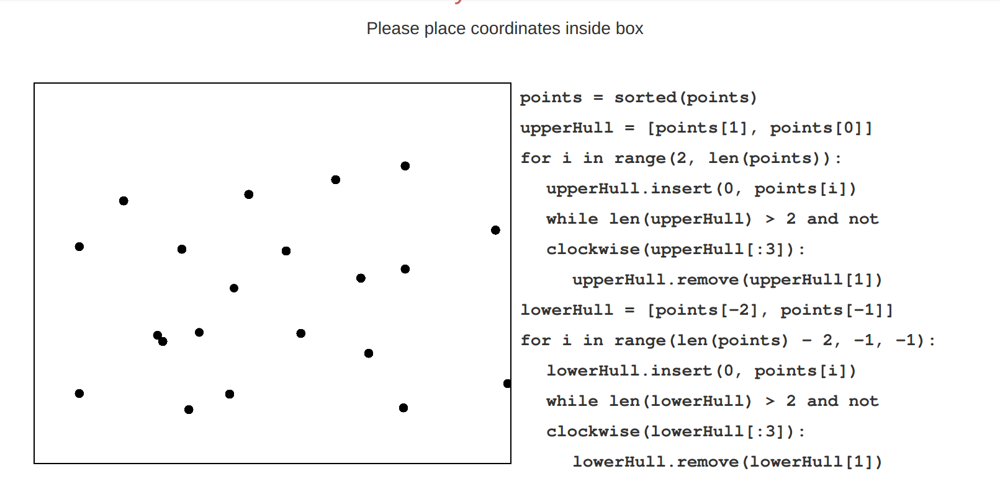

## Installation Guide

### Step 1

If node and npm are not currently installed on your system please see the following https://www.npmjs.com/package/v5/tutorial to install the most up to date version. If node and npm are already installed you can move to step 2.

### Step 2

```
$ git clone https://gitlab.computing.dcu.ie/godwinc3/2018-CA326-cgodwin-algo3.git
$ cd 2018-CA326-cgodwin-algo3/code
$ npm install
$ npm start
```

### Step 3 

The website will now be visible at https://localhost:3000

## Navigating Website


Once you've followed the installation guide this is what you will see at https://localhost:3000
As you can see from the blue bar at the top this is where you can navigate through the website. 


If you click on sorting you will get an option for more webpages as seen in the image above. This is the same for Computational Geometry and Network Flow. 

## Using Animation
  
  

  Once you see the heading "Try it Yourself" as shown above you can view the algorithm in action.
  
  See below the directions on how to interact with the animations

  ## Sorting Algorithms
  
  
  
  First enter your desired numbers as shown above.
  
  
  
  Second click the button above to start the animation.
  
  
  
  Click the button above to increase the speed of the animation.
  
  
  
  Click the button above to slow down the animation.
  
  
  
  Click the button above to pause the animation.
  
  ## Convex Hull
  
  
  
  Enter points into box in any desired order as shown above.
  
  
  
  Second click the button above to start the animation.
  
  
  
  Click the button above to increase the speed of the animation.
  
  
  
  Click the button above to slow down the animation.
  
  
  
  Click the button above to pause the animation.
  
  
  
  Click the button above to reset the animation.
  
  ## Bipartite Matching
  
  
  
  Click the button above to start the animation.


## Using Quiz:

  

  Once you see the heading "Questions" this is where you can test yourself on your knowledge of the algorithms.

  See below the guidelines on how to use the questions. 

  Enter answers to quiz questions as directed.

  
  
  Click the button above to reset the question.
  
  
  
  Click the button above to submit your answer.

  
  
  Click the button above to go to the next question.
  
  
  
  Click the button above to go to the previous question.